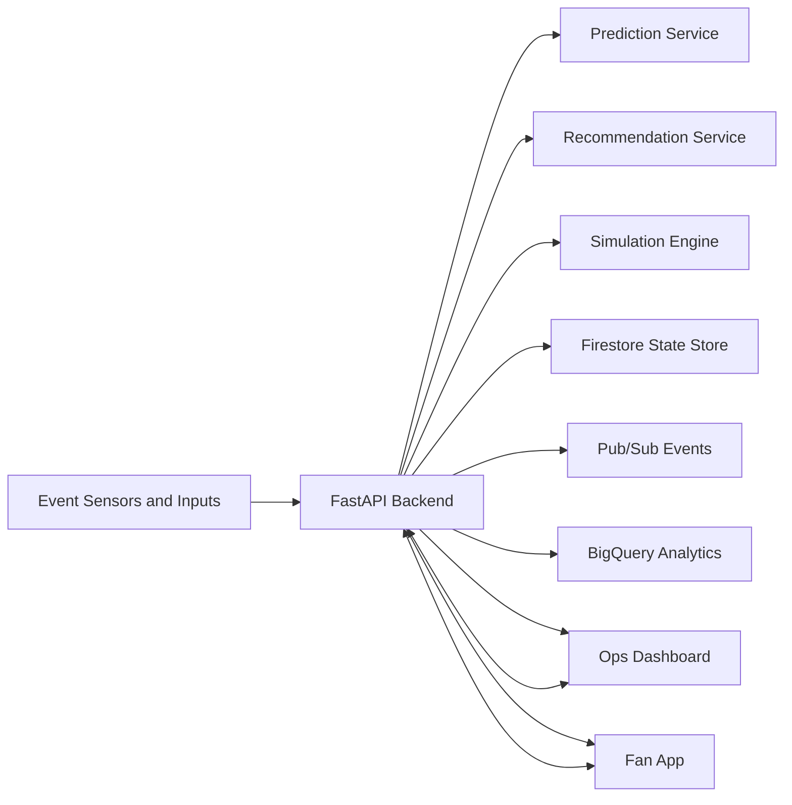

# Stadium OS

Real-time crowd intelligence platform for live events.

Stadium OS helps venue operations teams detect congestion early, act faster, and improve fan flow in real time through predictions, interventions, and live guidance.

## Problem

Large venues struggle with:

- Delayed visibility into crowd pressure by zone.
- Queue overload at gates, concessions, and restrooms.
- Slow manual interventions by operations teams.
- Poor fan experience from uncertainty and waiting.

## Solution

Stadium OS provides:

- Live command center for venue operators.
- Fan-facing assistant for best gate, shortest concession line, and exit guidance.
- Predictive queue intelligence and intervention recommendations.
- Simulation mode for repeatable demonstrations and KPI comparison.

## Core Features

- Real-time venue state across zones and queues.
- WebSocket-first updates with fallback polling.
- Queue forecasting and congestion scoring.
- Intervention recommendation engine with anti-herding logic.
- Notification pipeline for zone-targeted alerts.
- KPI dashboard comparing baseline vs optimized outcomes.
- Local mode and GCP mode support.

## System Architecture



## Tech Stack

- Backend: FastAPI, Uvicorn, Python
- Frontend: React, Vite
- Data and Messaging (optional managed mode): Firestore, Pub/Sub, BigQuery
- Deployment: Docker, Nginx, Google Cloud Run

## Repository Structure

- Backend API and services: [backend](backend)
- Operations dashboard: [dashboard](dashboard)
- Fan mobile-style web app: [fan-app](fan-app)
- GCP deployment guide: [GCP_DEPLOYMENT.md](GCP_DEPLOYMENT.md)

## Quick Start (Local)

### Prerequisites

- Python 3.10+
- Node.js 18+
- npm

### 1. Start Backend

```powershell
cd backend
python -m venv .venv
.\.venv\Scripts\Activate.ps1
pip install -r requirements.txt
$env:USE_GCP="false"
uvicorn main:app --host 0.0.0.0 --port 8000 --reload
```

### 2. Start Operations Dashboard

```powershell
cd dashboard
npm install
npm run dev
```

### 3. Start Fan App

```powershell
cd fan-app
npm install
npm run dev -- --port 5174
```

### 4. Open Apps

- Dashboard: http://localhost:5173
- Fan App: http://localhost:5174
- Backend health: http://localhost:8000/health

## API Highlights

- Health: GET /health
- Simulation start: POST /simulation/start
- Simulation status: GET /simulation/status
- Venue state: GET /state/{venue_id}
- Interventions: GET /interventions/{venue_id}
- Fan best gate: GET /fan/{venue_id}/best-gate
- Fan best concession: GET /fan/{venue_id}/best-concession
- Fan exit guidance: GET /fan/{venue_id}/exit-guidance

See service implementation in [backend/main.py](backend/main.py).

## Demo Flow

1. Open dashboard and fan app side-by-side.
2. Start simulation from dashboard.
3. Show live zone status and queue shifts.
4. Show interventions appearing in operations panel.
5. Show fan app auto-surfacing better gate and concession choices.
6. End on KPI dashboard to explain measurable operational impact.

## Deployment on Google Cloud Platform

Two supported modes:

1. Multi-service deployment (recommended for scale): backend + dashboard + fan app.
2. Single-service monolith deployment (fastest setup) using root Dockerfile.

Full instructions are in [GCP_DEPLOYMENT.md](GCP_DEPLOYMENT.md).

## Reliability and Operations Notes

- Works in local fallback mode without cloud credentials.
- GCP-managed mode can be enabled via environment variables and IAM.
- Frontend endpoints are runtime-configurable for flexible deployments.
- WebSocket connectivity gracefully degrades to polling.

## Future Extensions

- Historical trend analytics and anomaly alerts.
- Staff allocation optimization.
- Dynamic pricing and demand shaping.
- Multi-venue control plane.
